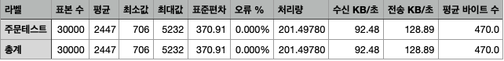
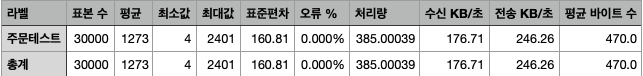

# 옷 선착순 구매 MSA 기반 프로젝트
이 프로젝트는 마이크로서비스 아키텍처(MSA)를 기반으로 하여 선착순 옷 구매를 구현하였습니다. 
사용자들이 특정 상품을 선착순으로 구매할 수 있는 기능을 제공하며, 
대용량 트래픽을 효과적으로 처리하기 위해 다양한 기술 스택과 아키텍처 패턴을 적용하였습니다.

### 기술 스택

---
- **프로그래밍 언어**: Java
- **프레임워크**: Spring Boot
- **데이터베이스**: Postgresql, Redis
- **메시지 브로커**: Kafka
- **API 관리**: Spring Cloud Netflix Eureka
- **인증 및 인가**: JWT, Spring Security
- **부하 테스트**: JMeter

### 아키텍처

---
- **API Gateway**: 모든 클라이언트 요청을 수신하고 각 마이크로서비스로 라우팅하는 역할 + 사용자 인증 및 권한 부여
- **멤버 서비스**: 가입, 로그인, 리프레시, 로그아웃 등 사용자 관리
- **상품 서비스**: 상품 정보 관리 및 제공
- **주문 서비스**: 주문 생성 및 관리
- **재고 서비스**: 실시간 재고 관리 및 업데이트
- **결제 서비스**: 결제 처리 및 완료
- **이벤트 스트리밍**: Kafka를 사용한 비동기 이벤트 처리 및 통합
- **데이터베이스**: PostgreSQL을 주요 데이터 저장소로 사용하며, Redis를 캐싱 및 토큰 관리를 위해 사용

### API 목록

---
#### 멤버 서비스
- **POST /member/login**
  - 사용자 로그인
- **POST /member/join**
  - 회원가입
- **POST /member/email/send**
  - 인증번호 메일 보내기
- **POST /member/email/verify**
  - 인증번호 확인하기
- **GET /member/refresh**
  - 토큰 리프레시
- **GET /member/mypage**
  - 내 정보 확인
- **PUT /member/mypage**
  - 내 정보 수정
- **PATCH /member/password**
  - 비밀번호 수정
- **DELETE /member/logout**
  - 해당 기기에서 로그아웃
- **DELETE /member/logout/all**
  - 전체 기기에서 로그아웃

#### 상품 서비스
- **GET /cloth/list**
  - 상품 리스트 조회
- **GET /cloth/detail/{clothId}**
  - 상품 상세페이지 조회
- **POST /cloth/inventory**
  - 상품들 재고 조회 (feignclient 용도)
- **POST /cloth/details**
  - 상품들 정보 조회 (feignclient 용도)
- **PUT /cloth/inventory**
  - 결제 완료 후 최종 재고 업데이트

#### 주문 서비스
- **POST /orders/add**
   - 상품 주문
- **POST /orders/add/Wishlist**
   - 위시리스트 내 상품 주문
- **PUT /orders/cancel** 
   - 주문 취소 요청
- **PUT /orders/refund**
   - 주문 환불 요청
- **GET /orders/detail/{orderId}**
   - 주문 상세 조회
- **GET /orders/list/{memberId}**
  - 유저 주문 내역 조회
- **POST /wishlist/add**
  - 위시리스트에 상품 추가
- **PUT /wishlist/update**
  - 위시리스트의 수량을 변경
- **DELETE /wishlist/delete**
  - 위시리스트의 상품을 삭제

#### 결제 서비스
- **POST /payment**
  - 결제 진입
- **PUT /payment/{orderId}**
  - 결제 완료

### 주요 기능

---
- **JWT 인증**: JWT를 사용하여 사용자 인증 및 권한 부여
- **실시간 재고 관리**: Redis를 사용하여 실시간으로 재고 상태를 관리하고 업데이트
- **비동기 이벤트 처리**: Kafka를 사용하여 주문, 결제 등 이벤트를 비동기적으로 처리, 보상 트랜잭션 적용

### 트러블 슈팅

---
- **문제**: Kafka 서버 장애 시 데이터베이스의 원자성 보장 문제
    - **해결 방안**: Outbox 패턴을 적용하여 데이터 간 원자성 보장
- **문제**: 주문 생성 시 재고 부족 문제 발생
    - **해결 방안**: 재고 서비스에서 분산 락을 사용하여 동시성 이슈 해결

### 성능 개선

- **환경**: 초당 500건의 요청을 60초 동안 총 30,000건 생성, localhost에서 부하 테스트 진행하므로 적당한 부하를 가정
- **가설 1**: FeinClient를 사용하여 재고 서비스 요청 시 성능 저하가 발생할 것이라고 가정
- **가설 2**: redis를 사용하여 재고 정보를 캐싱하면 성능이 향상될 것이라고 가정
---
redis 캐싱을 적용한 경우, throughput 약 1.9배 정도 향상되었음
#### Redis 캐싱 사용 전

#### 사용 후
